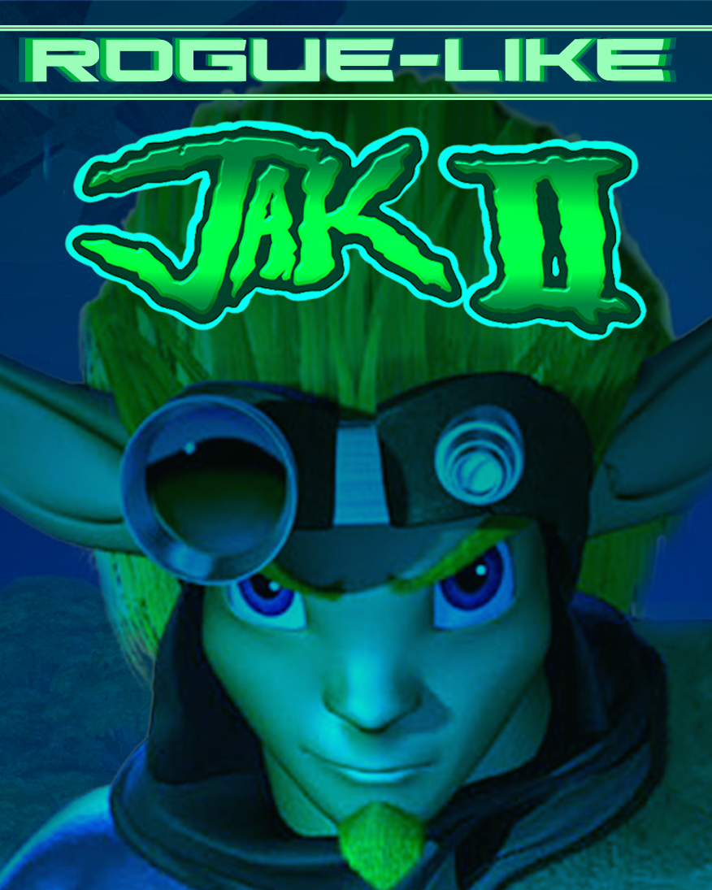

<h1 style="text-align: center;">Roguelike Jak II is a revamped version of Jak II featuring Rogue-Like elements such as permadeath, in-run and out-of-run shop, and a fully custom story based off of the original timeline.</h1>

<h3>The Jak Time-Loop is broken! In a world where the multiverse exists, a rogue AI has made the protagonist cease to exist in multiple dimensions, making them unstable! To repair the time loop, Jak must fix the past, present, and the future by going back and playing random missions that get more difficult as you complete more in a row. As the enemies get stronger, so can you! Use the in-run shop to purchase items that will make you stronger in your run.</h3>

<h3>You can use the out-of-run shop in the hub to purchase items permanently, and it will appear to buy on the in-run shop.</h3>
<h3 style="color: red;">Be careful! Jak keeps his HP throughout the random missions. If Jak dies, you lose all items that you bought from the in-run shop!</h3>
<h2>The goal is to collect <strong style="color: purple;">Tokens</strong> to purchase items to put into your run, alongside the skill it takes to prevent dying, and reaching the end goal of repairing the time loop:</h2>
<h3 style="text-align: center;">Beat Metal Kor on the final mission, and restore balance to the multiverse.</h3>

